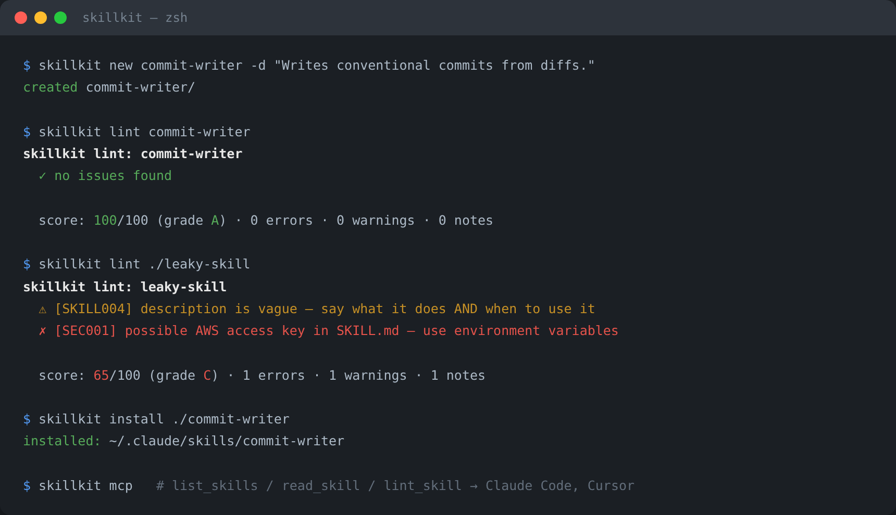

<!-- mcp-name: io.github.furkan708/skillkit -->

# 🧰 skillkit

[](https://www.python.org/)


[](https://github.com/furkan708/skillkit/actions/workflows/ci.yml)  


**The toolbox for AI agent skills.** Scaffold, lint, pack, and install
[SKILL.md](https://agentskills.io) skills — and serve your whole skill library
to Claude Code, Cursor, and any MCP client with a built-in **Model Context
Protocol server**.



> Community audits found that the overwhelming majority of published
> SKILL.md files carry at least one "skill smell" — and a large share leak
> secrets. skillkit catches those before you ship.

📖 **Deep docs:** [Usage guide](docs/USAGE.md) — lint rules reference, MCP patterns, CI usage · [Architecture](docs/ARCHITECTURE.md) · [Contributing](CONTRIBUTING.md) · [Changelog](CHANGELOG.md) · [Security](SECURITY.md)

## ✨ Features

- 🆕 **`new`** — scaffold a spec-compliant skill folder in one command
- 🔍 **`lint`** — validate against the Agent Skills spec *plus* security smells:
  leaked API keys, vague descriptions, oversized bodies, folder typos, and more
  (scored 0–100 with a grade)
- 📦 **`pack`** — zip a skill for upload to skill-capable platforms
- 📥 **`install`** — install from a folder or any git URL into
  `~/.claude/skills` (or your own directory)
- 🗂️ **`list` / `remove`** — manage your installed skill library
- 🔌 **`mcp`** — a **zero-dependency MCP server** (stdio, JSON-RPC 2.0) that
  exposes `list_skills`, `read_skill`, and `lint_skill` tools to any client
- 🪶 **Zero dependencies** — pure Python standard library
- 🧪 **76 tests**, CI on Python 3.10 → 3.12

## 🚀 Quick start

```bash
# run without installing (uvx — pulls from PyPI on demand)
uvx --from skillkit-cli skillkit lint ./skills

# or install (installs the `skillkit` command)
pipx install skillkit-cli

# ...or from source
git clone https://github.com/furkan708/skillkit.git
cd skillkit && pip install .

# 1. create a skill
skillkit new commit-writer -d "Writes conventional commit messages from staged diffs. Use when the user asks to commit changes."

# 2. lint it (spec + security + quality)
skillkit lint commit-writer
#   ✓ no issues found
#   score: 100/100 (grade A) · 0 errors · 0 warnings · 0 notes

# 3. pack it for upload
skillkit pack commit-writer        # → commit-writer.zip

# 4. install it for Claude Code
skillkit install ./commit-writer   # → ~/.claude/skills/commit-writer
```

## 🔌 Serve your skills over MCP

Add skillkit to any MCP client config — Claude Code, Cursor, Windsurf, and
every other MCP-compatible agent:

```json
{
  "mcpServers": {
    "skillkit": { "command": "skillkit", "args": ["mcp"] }
  }
}
```

Your agent can now discover and read every installed skill on demand:

| Tool          | What it does                                        |
| ------------- | --------------------------------------------------- |
| `list_skills` | Discover installed skills with names + descriptions |
| `read_skill`  | Load the full SKILL.md instructions of one skill    |
| `lint_skill`  | Validate a skill and get its quality score          |

## 🔍 What lint catches

| Rule | Severity | Check |
| ---- | -------- | ----- |
| SEC001 | ✗ error | Leaked secrets: GitHub/AWS/OpenAI/Slack tokens, private keys, hardcoded credentials |
| SKILL001 | ✗ error | Invalid `name`: charset, length ≤ 64, reserved words (`anthropic`, `claude`) |
| SKILL002 | ✗ error | `name` does not match the folder name |
| SKILL003 | ✗ error | `description` longer than 1,024 characters |
| SKILL009 | ✗ error | `metadata` is not a string→string map |
| SKILL004 | ⚠ warn | Vague description (won't trigger — describe *what* and *when*) |
| SKILL005 | ⚠ warn | Body over ~500 lines (move detail into `references/`) |
| SKILL007 | ⚠ warn | Folder typos: `script/`, `reference/`, `docs/`… |
| SKILL006 | · info | Very thin body — add steps and examples |
| SKILL008 | · info | Unknown frontmatter fields |

Every run ends with a **0–100 score and a letter grade**, so you know when a
skill is ready to publish.

## 📖 CLI reference

```
skillkit new <name> -d <description> [--dir DIR]   scaffold a skill
skillkit lint <path> [--json] [--strict]           validate a skill
skillkit pack <path> [-o FILE.zip]                 zip for upload
skillkit install <path|git-url> [--agent claude|project] [--dir DIR]
skillkit list [--agent ...] [--dir DIR] [--json]   show installed skills
skillkit remove <name> [--dir DIR]                 uninstall a skill
skillkit mcp [--dir DIR]                           serve skills over MCP
```

Built on the open [Agent Skills specification](https://agentskills.io) —
the same format supported by 40+ platforms including Claude, OpenAI Codex,
and GitHub Copilot.

## 🧪 Tests

```bash
pip install pytest
pytest -v
```

## 🗂️ Project Structure

```
skillkit/
├── skillkit/
│   ├── frontmatter.py   # minimal YAML frontmatter parser
│   ├── model.py         # skill loading (Agent Skills spec)
│   ├── linter.py        # rules, security smells, 0-100 score
│   ├── scaffold.py      # new + pack
│   ├── installer.py     # install / list / remove (folder or git)
│   ├── mcp_server.py    # zero-dependency MCP stdio server
│   └── cli.py           # command-line interface
└── tests/
```

## 🗺️ Roadmap

- [ ] `skillkit search` — search community skill registries
- [ ] More install targets (Codex, Copilot CLI paths as they standardize)
- [ ] `skillkit doctor` — prompt-injection heuristics *(planned, not implemented yet)*

## 📄 License

MIT — see the [LICENSE](LICENSE) file for details.
